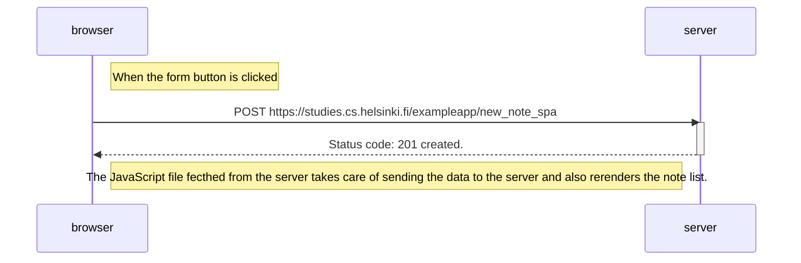

```mermaid
sequenceDiagram

    participant browser
    participant server

    Note right of browser: When the form button is clicked

    browser->>server: POST https://studies.cs.helsinki.fi/exampleapp/new_note_spa
    activate server
    server-->>browser: Status code: 201 created.
    deactivate server

    Note right of browser: The JavaScript file fecthed from the server takes care of sending the data to the server and also rerenders the note list.

```